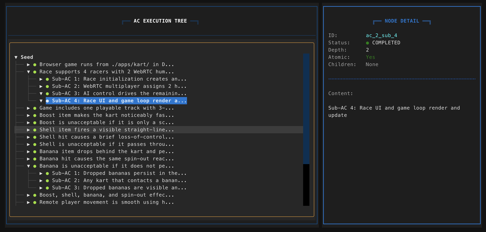

# Ouroboros Kart

Browser-playable combat kart racing game generated from an Ouroboros oneshot
seed. This repository contains the extracted `apps/kart` package: a Desktop
Chrome game with a real 2-human WebRTC race, 2 AI racers, host-authoritative
gameplay, one 3-lap track, and Mario Kart-like boost, shell, banana, and
spin-out combat.



## What Ouroboros Backend Codex Accepted

Ouroboros backend Codex accepted `seed.yaml` as the contract and worked only
inside `apps/kart/**`. The accepted scope was:

- Standalone Vite + TypeScript app with its own `package.json` and `tsconfig`.
- Canvas-based browser game using Three.js rendering and Cannon-style physics
  modeling where needed.
- Node WebSocket signaling server for WebRTC setup.
- RTCDataChannel gameplay traffic after signaling.
- Host-authoritative race simulation, item pickup judgement, item effects,
  race progress, and finish order.
- 4-racer race: 2 WebRTC human racers plus 2 MVP AI opponents.
- One playable track, 3 laps, target race length around 2 minutes.
- Combat item system for boost, shell, banana, item boxes, single-slot
  inventory, multiplayer replication, and visual feedback.

The implementation intentionally stays isolated from the Python Ouroboros
project source, skills, and tests.

## Codex Session Cost

This build was produced with 204 Codex sessions on GPT-5.5 x high. It was run
through a subscription plan, so this is not a direct pay-as-you-go invoice. If
the same usage were converted with the token arithmetic below, the estimated
cost would be:

```text
Non-cached input: 21,171,112  / 1M × $5  = $105.86
Cached input:    602,924,160 / 1M × $0.50 = $301.46
Output:            2,515,950 / 1M × $30  =  $75.48
                                          ─────────
                                          $482.80
```

Most of the estimated cost comes from cached input, not output. For future
runs, the biggest optimization opportunity is likely reducing repeated context
reuse across many sessions: keep task slices smaller, avoid re-reading very
large generated files unless needed, and run targeted validations during
iteration before the full suite.

## Run It

```bash
npm install
npm run server
npm run dev
```

Run the commands from this repository root. Open `http://127.0.0.1:5173/` in
Desktop Chrome. The signaling server listens on `ws://localhost:8787`.

## Verification

```bash
npm run build
npm test
```

Current local verification:

- `npm run build` passes.
- `npm test` passes the full validation suite.
- The validation suite covers race flow, collisions, AI, item behavior, item
  visuals, WebRTC signaling, host-authoritative snapshots, multiplayer item
  replication, and gameplay message schemas.

## AC-by-AC Completion

| Acceptance criterion | Status | Evidence |
| --- | --- | --- |
| Browser game runs from the extracted `apps/kart` package in Desktop Chrome. | Complete | `npm run build`, Vite dev server, `index.html`, `src/main.ts`. |
| Race supports 4 racers with 2 WebRTC humans and 2 AI opponents. | Complete | `validate:four-racer-flow`, `validate:roster`, `src/race/raceStartRoster.ts`. |
| One playable track with 3-lap race flow. | Complete | `validate:track-gameplay-metadata`, `validate:race-progress`, `validate:roster`. |
| Boost makes kart faster with visible camera/FOV widening and particle trail. | Complete | `validate:item-effects`, `validate:boost-camera`, `validate:boost-particles`. |
| Boost is not just a scalar speed change. | Complete | Boost has runtime effect, FOV feedback, particle trail, HUD state, and render feedback. |
| Shell fires a visible straight-line forward projectile. | Complete | `validate:shell-projectile-visual`, `validate:item-effects`, `validate:gameplay-messages`. |
| Shell hit causes brief loss-of-control spin-out in the 1-2s feel range. | Complete | `validate:item-behavior-tuning`, `validate:item-effects`, `validate:spinout-visual`. |
| Shell cannot pass through karts or hit with no reaction. | Complete | `validate:kart-to-kart-collisions`, `validate:item-collision-outcomes`, `validate:multiplayer-item-collisions`. |
| Banana drops behind kart and persists as a static hazard until hit or race end. | Complete | `validate:banana-events`, `validate:item-collision-outcomes`, `src/race/raceSession.ts`. |
| Banana hit causes the same spin-out reaction class as shell. | Complete | `validate:item-collision-outcomes`, `validate:item-effects`, `validate:spinout-visual`. |
| Banana is visible and replicated, not only visible to the dropper. | Complete | `validate:banana-events`, `validate:multiplayer-item-collisions`, `validate:multiplayer-replication-harness`. |
| Boost, shell, banana, and spin-out effects synchronize within the latency target. | Complete | `validate:multiplayer-replication-harness` reports item effect samples within the 150ms target. |
| Remote movement is smooth using host-authoritative simulation with remote input deltas. | Complete | `validate:remote-input-deltas`, `validate:remote-inputs`, `validate:host-authoritative-snapshot-broadcast`. |
| Item combat was feel-checked and iterated toward Mario Kart-like behavior. | Complete | `docs/item-combat-playtest-rubric.md`, `validate:item-combat-playtest-metrics`, tuning validations. |
| Simple particles and minor spin animation jitter are acceptable. | Complete | Boost trail, spin-out visual, shell impact/removal, banana visual feedback are implemented. |
| AI may use items suboptimally. | Complete | AI driving and item-use behavior exist with MVP validations in `validate:ai-controller` and `validate:ai-item-pickups`. |
| Track contains fixed item box positions along the racing line. | Complete | `validate:item-pickup-cadence`, `src/config/tracks.ts`. |
| Item box pickup grants exactly one random item from boost, shell, banana. | Complete | `validate:item-pickup-cadence`, `validate:ai-item-pickups`, `validate:roster`. |
| Item boxes regenerate after a short delay. | Complete | `validate:item-pickup-cadence`, `validate:ai-item-pickups`. |
| Each kart holds at most one item at a time. | Complete | `validate:item-pickup-cadence`, `validate:ai-item-pickups`, race session inventory rules. |
| Item pickup judgement is host-authoritative and propagated to peers. | Complete | `validate:ai-item-pickups`, `validate:banana-events`, `validate:gameplay-messages`, host snapshot validations. |

## Implementation Map

- `src/main.ts`: browser entry point, game loop, lobby UI, render orchestration,
  input handling, WebRTC integration, HUD drawing, and combat feedback.
- `src/race/raceSession.ts`: host-authoritative race state, item pickups,
  inventory, boost/shell/banana effects, spin-out, collision outcomes, AI item
  use hooks, and race progress.
- `src/config/tracks.ts`: the shipped track, road geometry, checkpoints,
  start grid, obstacles, boundaries, and item boxes.
- `src/ai/aiController.ts`: MVP AI routing, recovery, throttle/steer control,
  and driving decisions.
- `src/network/*`: signaling payloads, peer roles, remote inputs, transform
  snapshots, authoritative player/race-state snapshots, item/effect events, and
  multiplayer replication harnesses.
- `server/signalingServer.ts`: Node WebSocket room/signaling server used before
  RTCDataChannel gameplay traffic starts.
- `docs/item-combat-playtest-rubric.md`: human playtest checklist for the item
  combat feel target.

## Current Caveat

The automated suite validates the accepted ACs, including multiplayer
replication harnesses. A final two-browser Desktop Chrome playtest is still the
best end-to-end confirmation for input feel, visual readability, and perceived
latency.
